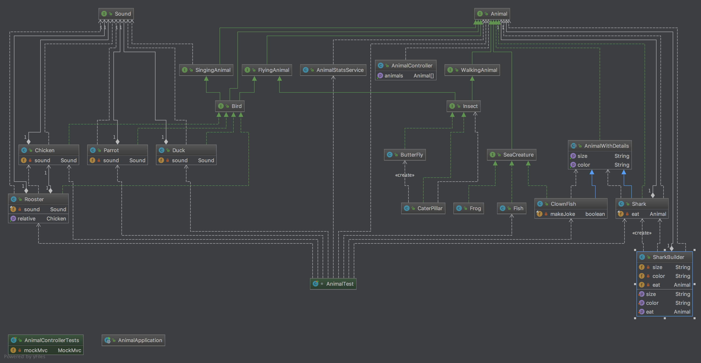

### A sample object hierarchy for Animal World with REST API

``com.example.animal.model`` package contains the Animal model hierarchy

``AnimalApplication.java`` is <i>SpringBoot</i> Application, ``AnimalController`` has *REST API* for querying Animal model.

